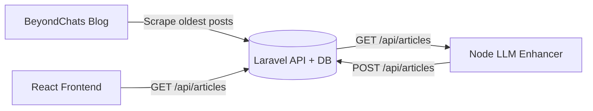

# ContentRefinery

A three-part pipeline that scrapes BeyondChats blog posts, enhances them with an LLM using references from Google search, and displays both original and AI-generated content in a React UI.

## Architecture / Data Flow



## Repo Structure

- `backend-laravel/` Laravel API + database + scraping command
- `llm-node/` Node script for Google search, scraping, and LLM rewriting
- `frontend-react/` React UI for original + AI enhanced articles

## Requirements

- PHP 8.2+, Composer
- Node.js 18+
- SQLite/MySQL (SQLite works out of the box)

## Local Setup

### 1) Backend (Laravel)

```bash
cd backend-laravel
cp .env.example .env
composer install
php artisan key:generate
php artisan migrate
php artisan serve
```

Scrape the 5 oldest articles (from the last page of `/blogs/`):

```bash
php artisan scrape:beyondchats --count=5
```

### 2) LLM Enhancer (Node)

```bash
cd llm-node
cp .env.example .env
npm install
```

Update `llm-node/.env` with your keys:

- `SERPER_API_KEY` (Google search)
- `GROQ_API_KEY` or `OPENAI_API_KEY` (LLM provider)

Run the enhancer:

```bash
node index.js
```

Enhancer modes:

- `ENHANCE_MODE=all` (default): enhance all original articles that do not already have an AI version.
- `ENHANCE_MODE=latest`: enhance the latest original article only.

Optional controls:

- `MAX_ARTICLES=0` (no limit)
- `REQUEST_DELAY_MS=0` (pause between articles)

### 3) Frontend (React)

```bash
cd frontend-react
cp .env.example .env
npm install
npm run dev
```

Open the dev server URL from Vite and verify both sections:
- Original Articles
- AI Enhanced Articles

## Deployment (Managed: Render/Railway + Vercel/Netlify)

### Backend (Laravel) on Render or Railway

1) Create a new web service from `backend-laravel/`.
2) Set build command:
   - `composer install --no-dev --optimize-autoloader`
3) Set start command:
   - `php artisan serve --host 0.0.0.0 --port $PORT`
4) Add environment variables:
   - `APP_KEY` (generate via `php artisan key:generate --show`)
   - `APP_ENV=production`, `APP_DEBUG=false`, `APP_URL=https://your-backend-url`
   - DB credentials for the provider's managed database.
5) Run migrations from the provider shell:
   - `php artisan migrate --force`
6) (Optional) Run scraping once:
   - `php artisan scrape:beyondchats --count=5`

### Frontend on Vercel or Netlify

1) Create a new project from `frontend-react/`.
2) Build command:
   - `npm ci && npm run build`
3) Output directory:
   - `dist`
4) Set environment variable:
   - `VITE_API_URL=https://your-backend-url`

### LLM Enhancer (Scheduled Job)

Run the Node script on a schedule with Render Cron or GitHub Actions.

- Set `API_BASE_URL` to your deployed Laravel URL.
- Add `SERPER_API_KEY` and `GROQ_API_KEY` (or `OPENAI_API_KEY`).

Example GitHub Action (nightly):

```yaml
name: Run LLM Enhancer
on:
  schedule:
    - cron: '0 2 * * *'
jobs:
  enhance:
    runs-on: ubuntu-latest
    steps:
      - uses: actions/checkout@v4
      - uses: actions/setup-node@v4
        with:
          node-version: 20
      - run: cd llm-node && npm ci
      - run: cd llm-node && node index.js
        env:
          API_BASE_URL: ${{ secrets.API_BASE_URL }}
          SERPER_API_KEY: ${{ secrets.SERPER_API_KEY }}
          GROQ_API_KEY: ${{ secrets.GROQ_API_KEY }}
```

## Live Link (Frontend)

- `https://contentrefinery.netlify.app/` (homepage shows Original Articles + AI Enhanced Articles; click a card to open full text)

## Notes

- `.env` files are ignored; use `.env.example` as a template.
- The UI shows both original and AI-enhanced entries and allows full-article viewing in a modal.
