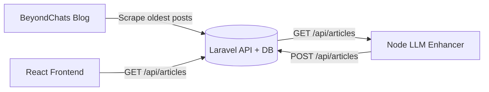

# ContentRefinery

A three-part pipeline that scrapes BeyondChats blog posts, enhances them with an LLM using references from Google search, and displays both original and AI-generated content in a React UI.

## Architecture / Data Flow



## Repo Structure

- `backend-laravel/` Laravel API + database + scraping command
- `llm-node/` Node script for Google search, scraping, and LLM rewriting
- `frontend-react/` React UI for original + AI enhanced articles

## Requirements

- PHP 8.2+, Composer
- Node.js 18+
- SQLite/MySQL (SQLite works out of the box)

## Local Setup

### 1) Backend (Laravel)

```bash
cd backend-laravel
cp .env.example .env
composer install
php artisan key:generate
php artisan migrate
php artisan serve
```

Scrape the 5 oldest articles (from the last page of `/blogs/`):

```bash
php artisan scrape:beyondchats --count=5
```

### 2) LLM Enhancer (Node)

```bash
cd llm-node
cp .env.example .env
npm install
```

Update `llm-node/.env` with your keys:

- `SERPER_API_KEY` (Google search)
- `GROQ_API_KEY` or `OPENAI_API_KEY` (LLM provider)

Run the enhancer:

```bash
node index.js
```

Enhancer modes:

- `ENHANCE_MODE=all` (default): enhance all original articles that do not already have an AI version.
- `ENHANCE_MODE=latest`: enhance the latest original article only.

Optional controls:

- `MAX_ARTICLES=0` (no limit)
- `REQUEST_DELAY_MS=0` (pause between articles)

### 3) Frontend (React)

```bash
cd frontend-react
npm install
npm run dev
```

Open the dev server URL from Vite and verify both sections:
- Original Articles
- AI Enhanced Articles

## Live Link

- TODO: add deployment URL

## Notes

- `.env` files are ignored; use `.env.example` as a template.
- The UI shows both original and AI-enhanced entries and allows full-article viewing in a modal.
